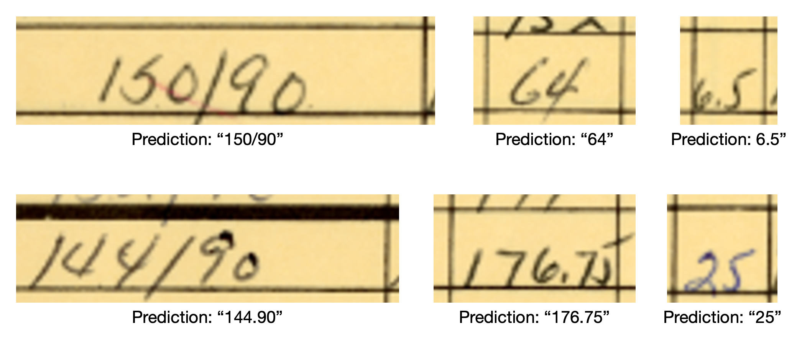

# DeepVision OCR: Advancing Optical Character Recognition with Transformers

DeepVision-OCR-Transformers is a robust Optical Character Recognition (OCR) framework that leverages the power of transformer models for highly accurate text extraction from images. This project is built for tasks like document digitization, text extraction from images, and enhancing text recognition capabilities with state-of-the-art deep learning techniques.

## 🚀 Features

- **Transformer-based OCR:** Combines the strengths of transformers for sequence modeling with computer vision capabilities.
- **High accuracy:** Designed to extract text from complex image layouts with high precision.
- **Customizable:** Easily adapt to various OCR tasks and datasets.
- **Easy-to-use interface:** Simplifies the process of image preprocessing, model training, and text recognition.

### Model Output Example

Here's an example of the model's output:



## 📂 Project Structure
```
dataset/
├── train/
│   └── train.json        # Training images with labels
└── test/
    └── test.json         # Validation images
```
    
You can use the src/dataset.py scripts for data augmentation and preprocessing.

#### `src/` Directory Structure

```
src/
├── configs/
├── __init__.py
├── __main__.py
├── cli.py
├── context.py
├── dataset.py            # Data preprocessing and augmentation
├── main.py
├── scripts.py
├── starter.py            # Entry point for training the model
├── test.py
├── trainer.py            # Training logic
└── util.py
```

## 🛠️ Installation

1. Clone the repository:

    ```bash
    git clone https://github.com/suhas004/DeepVision-OCR-Transformers.git
    cd DeepVision-OCR-Transformers
    ```

2. Create a virtual environment (optional but recommended):

    ```bash
    python -m venv env
    source env/bin/activate  # On Windows: env\Scripts\activate
    ```

3. Install dependencies:

    ```bash
    pip install -r requirements.txt
    ```

4. Download the required pre-trained models (if applicable) as described in the `models/` directory documentation.


#### 📊 Dataset Preparation
Prepare your dataset for training and validation. Organize your data in the following structure:


🔍 Usage
1. Training the Model
To train the OCR transformer model, use the provided training scripts:

    ```bash
   python src/starter.py --local_model "microsoft/trocr-small-printed"
    ```
Modify the configuration file (local_model ) to specify models different encoder based transformer. eg ViT, Swin V2 


#### 🤝 Contributing
Contributions are welcome! If you find a bug, want to suggest a feature, or improve documentation, feel free to submit an issue or a pull request.
This project is currently under development. Please expect some bugs as I actively work on adding features and making improvements.  

#### 📜 License
This project is licensed under the MIT License.

#### 💬 Contact
For questions or support, please reach out to Suhas at ssasett1@jh.edu
